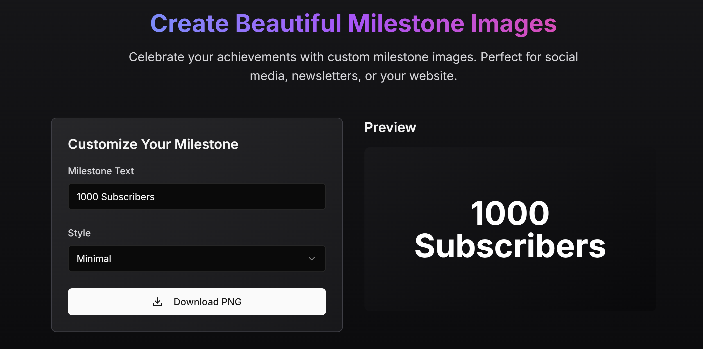

# 🎯 Milestone Visualizer

📸 **Create stylish visuals of your online milestones** — think 800 followers on X, a new YouTube sub-goal, or anything you want to celebrate. Fast. Visual. Shareable.  
Built with love by [@raimonvibe](https://github.com/raimonvibe) 💜

---

## 🖼️ Screenshot Preview


  

*(Make sure to upload these images to a `screenshots/` folder in your repo)*

---

## ⚙️ Features

✨ Google login (NextAuth)  
✨ Milestone editor with templates  
✨ Download as image  
✨ Stripe payments for premium designs  
✨ Dark mode support  
✨ No account needed for basic use  
✨ Tailwind-powered UI 💅

---

## 🧠 Technologies

- **Next.js** 14+
- **React** 18+
- **Tailwind CSS**
- **TypeScript**
- **NextAuth.js** for authentication
- **Stripe** for payments
- **Lucide** icons 🎨

---

## 📦 Installation

```bash
git clone https://github.com/raimonvibe/Milestone-visualizer.git
cd Milestone-visualizer
npm install
npm run dev
```

---

## 🔐 .env.local (example)

```env
NEXTAUTH_SECRET=...
NEXTAUTH_URL=http://localhost:3000

GOOGLE_CLIENT_ID=...
GOOGLE_CLIENT_SECRET=...

STRIPE_SECRET_KEY=...
STRIPE_WEBHOOK_SECRET=...
```

---

## 💡 Use Cases

✅ Share your wins on X, Instagram, YouTube, and TikTok  
✅ Inspire your community with visual achievements  
✅ Add style to your online growth

---

## 🧊 Live Demo

👉 [Milestone Visualizer on Vercel](https://milestone-visualizer.vercel.app) *(if deployed)*

---

## 🤝 Credits

Built with ❤️ by [Raimon](https://github.com/raimonvibe)  
Icons: [Lucide.dev](https://lucide.dev)  
Fonts: [Google Fonts](https://fonts.google.com)  
Inspiration: the world that celebrates your progress 🌍

---

## 📬 Contact

Have ideas or want to collaborate?  
Reach out on X or GitHub 🙌
